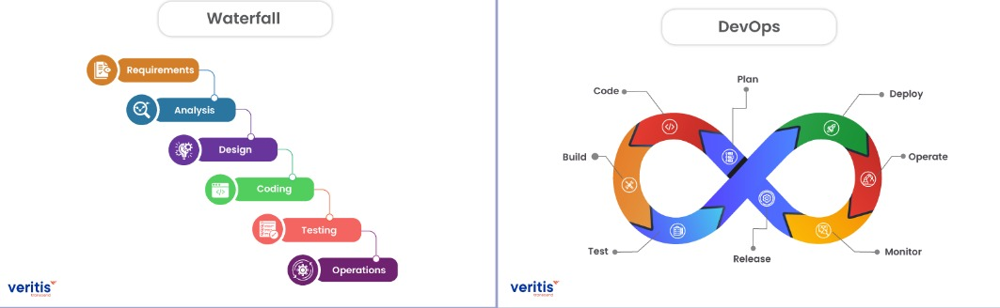
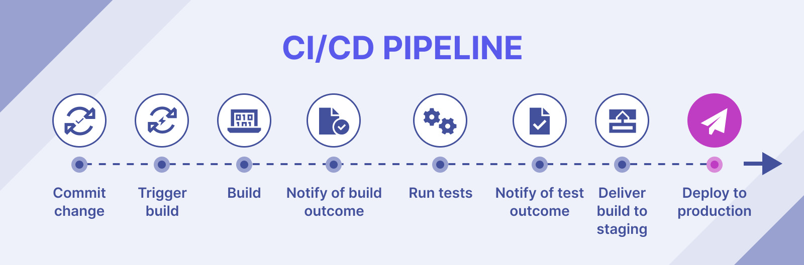

# Actividad 1 — Introducción DevOps / DevSecOps
Alumno: Miguel Angel Méndez Gonzalo  
Fecha: 2025-08-31  
Tiempo acumulado invertido hasta ahora: 01:51
Contexto del entorno: Trabajo local en Windows 10 con WSL2 y navegador Chrome (DevTools).

## 4.1 DevOps vs Cascada tradicional
En la siguiente imagen se muestra la diferencia visual entre el modelo de cascada y el enfoque DevOps.

**Imagen:** 

DevOps acelera y reduce el riesgo del software en la nube al adoptar el feedback continuo, lo que permite detectar problemas tempranamente. Utiliza pequeños lotes de cambio para limitar el impacto de los fallos y facilitar los rollbacks. Además, la automatización de tareas repetitivas elimina errores humanos y acelera la entrega de valor.

**Contexto donde cascada aún es razonable:** sistemas con certificaciones regulatorias muy estrictas (p. ej., aviación o dispositivos médicos).  
- **Criterio verificable 1:** requerimiento de auditoría oficial y firma de pruebas antes de despliegue.  
- **Criterio verificable 2:** existencia de procesos de certificación que impiden releases iterativos.  
**Trade-offs:** cumplimiento y trazabilidad vs velocidad e iteración.
---

## 4.2 Dos pasos y silos — limitaciones
Aquí se muestra la separación clásica entre construcción y operación. Esta práctica genera limitaciones:

1. Se acumulan grandes lotes antes de probar en producción.  
2. Los defectos se agrupan en colas largas, lo que aumenta tiempos de recuperación.

**Imagen:** 

**Anti-patrones identificados:**  
- "Throw over the wall": desarrollo entrega sin contexto → retrabajo.  
- Seguridad como auditoría final: vulnerabilidades se descubren demasiado tarde.  

Ambos elevan MTTR y costo de integración tardía, por handoffs y asimetrías de información.

---

## 4.3 Principios y beneficios DevOps
- **CI:** integrar cambios pequeños con pruebas automáticas inmediatas.  
- **CD:** generar artefactos listos para despliegue en cualquier momento.  
- **Práctica Agile que aporta:** las dailys y retrospectivas ayudan a decidir qué se promueve o bloquea en el pipeline.  

**Indicador observable definido:** tiempo desde que un PR queda listo hasta que se despliega en entorno de pruebas.  
Método de recolección: usar metadatos de PR (hora de merge) y registros de despliegue para calcular la mediana.

## 4.4 DevSecOps (SAST/DAST y gates)
**Ubicación en el pipeline (según BlackDuck):**  
- **SAST (Static Application Security Testing):** analiza código fuente/binaries en reposo. Se ejecuta tras el **Build**, antes de notificar el resultado, para encontrar vulnerabilidades temprano.  
- **DAST (Dynamic Application Security Testing):** analiza la aplicación en ejecución desde el exterior. Se ejecuta en el entorno de **Staging**, después de desplegar el build.  

**Gate mínimo:**  
- **SAST:** 0 vulnerabilidades críticas/altas (CVSS ≥ 7).  
- **DAST:** Cobertura ≥ 80% en rutas críticas (ejemplo: login, pagos).  

**Política de excepción:**  
- Duración máxima: 7 días.  
- Dueño asignado: líder técnico responsable del servicio.  
- Mitigación temporal documentada (ejemplo: WAF, reglas de firewall).  
- Excepción caduca automáticamente al 7.º día.  

**Señales para evitar “teatro de seguridad”:**  
1. Vulnerabilidades repetidas ≤ 5% entre despliegues consecutivos.  
2. Tiempo de remediación (TTR) de vulnerabilidades críticas ≤ 48 horas.  

## 4.5 Estrategia de despliegue: Pipeline CI/CD
**Estrategia elegida:** Sandbox → Pipeline CI/CD.  
Aplicada al microservicio de **autenticación**, esta estrategia permite validar cambios en un entorno seguro (*sandbox*) antes de pasar a producción. La ejecución controlada reduce el riesgo de introducir errores en un servicio crítico.  

**Imagen:** 

**Riesgos y mitigaciones:**
| Riesgo | Mitigación |
|---|---|
| Regresión funcional | Validación de contrato y pruebas automáticas antes de promover |
| Costo operativo del doble despliegue | Limitar la convivencia de entornos a menos de 1 hora |
| Manejo de sesiones | Draining de conexiones activas y compatibilidad de esquemas de base de datos |

**KPI primario técnico:**  
- Métrica: tasa de errores HTTP 5xx.  
- Umbral: ≤ 0.1% en una ventana de observación de 1 hora tras el despliegue.  
- Regla: si se supera, se aborta/promueve según resultado.  

**Pregunta retadora:**  
Aunque el KPI técnico (errores 5xx) se mantenga dentro del umbral, puede caer una métrica de producto como la conversión. Esto ocurre porque el sistema puede estar respondiendo “correctamente” desde un punto de vista técnico, pero generando una mala experiencia de usuario (por ejemplo, cambios en flujo de login). Por eso, los **KPIs técnicos y métricas de producto deben coexistir en el gate**: uno garantiza confiabilidad operativa y el otro asegura que la experiencia y valor de negocio no se degraden.
